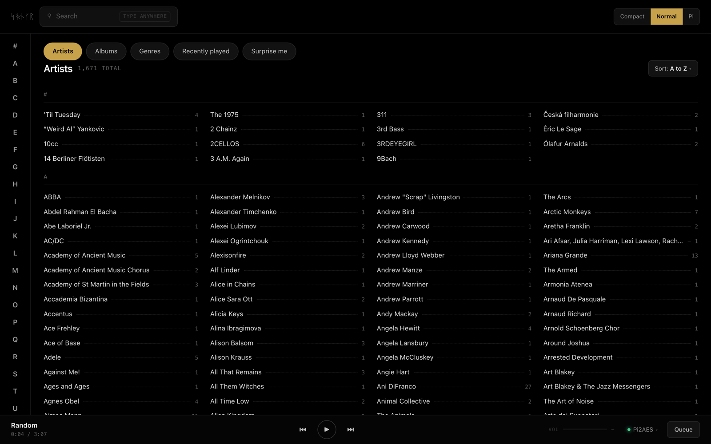

<p align="center">
  
</p>

<h1 align="center">Songr</h1>

<p align="center">A browser controller for your Roon Core.</p>

<p align="center">
  <a href="#desktop-app">Desktop app</a> ·
  <a href="#install">Server install</a> ·
  <a href="#configuration">Configuration</a> ·
  <a href="#security">Security</a> ·
  <a href="LICENSE">MIT</a>
</p>

---

Roon ships desktop and mobile control apps, but none for Linux. Songr fills
that gap two ways, from one codebase: a **desktop app** you download and run
like any other application, and a **self-hosted server** you point browsers
at. Either way it pairs with your Core as a Roon extension, then gives you
your library, search, transport, queue, and zones. No cloud, no account, no
telemetry.

Pick one:

- **[Desktop app](#desktop-app)** — for using Songr on this computer. One
  download, nothing else to run.
- **[Server install](#install)** — for a Raspberry Pi, NAS, or any always-on
  machine; every browser and tablet on the network gets the same controller.

## Screenshots

<p align="center">
  
  
</p>
<p align="center">
  
</p>

## Features

**Library.** Artists, Albums, and Genres scopes with alphabetic jump rails and
per-scope sorting, a Recently played scope, and a Surprise me shuffle. Album
sheets show full track listings with artwork. Density control switches between
Compact and Normal, plus a layout tuned for a Raspberry Pi touchscreen.

Two library views ship, and you can switch between them any time from the
settings menu in the top bar. **Library** is the default: it browses a catalog
Songr indexes from your Core, which is what makes the jump rails, sorting and
counts possible. **Classic** browses your Core live, folder by folder, the way
Roon's own browser does — it needs no index, so it is useful immediately and
useful if you prefer walking the hierarchy.

**Search.** An instant palette — start typing anywhere — with drill-down into
results. Search runs in an isolated browse session, so exploring a result never
disturbs the page you came from.

**Playback.** Play, pause, previous, next, seek, and volume, with a persistent
play bar carrying deep links to the current track and artist. Zone switching is
global, and now-playing state streams over Socket.IO so every open browser stays
in sync. Hardware media keys and the system's media panel follow the selected
zone — always in the desktop app, and in Chromium-family browsers too.

**Queue.** Per-zone queue with artwork, play-from-here, shuffle, loop, and auto
radio.

**Presentation.** Light and dark themes with a persisted preference, and artwork
cached to disk so browsing a large library stays quick.

## Desktop app

The same controller in its own window, with a tray icon, hardware media keys,
and a first-run guide that finds your Core. Download the build for your
platform from [Releases](https://github.com/roethlar/songr/releases):
AppImage, deb, or rpm on Linux (x64 and arm64), dmg on macOS (Apple Silicon
and Intel), or the Windows installer.

- The app runs its own copy of the Songr server, privately, on your machine —
  nothing else to install. Closing the window hides it to the tray; the music
  keeps playing.
- To play audio **on the computer itself**, install Roon Labs' free
  [Roon Bridge](https://roon.app/downloads) alongside (their official
  download, all three platforms) — Songr is a controller, and Roon Bridge is
  what makes the machine an audio zone in Roon. The app's first-run guide
  walks through it, and you can skip it if you only control other zones.
- The builds are currently unsigned, and recent macOS is strict about that:
  if the app is blocked on first open, allow it under System Settings →
  Privacy & Security → "Open Anyway"; if macOS calls the app "damaged"
  (Apple Silicon does this to unsigned downloads), clear the quarantine flag
  once with `xattr -dc /Applications/Songr.app`. Windows: SmartScreen →
  "More info" → "Run anyway".
- Advanced, off by default: from the tray's Advanced Settings the app can
  also serve browsers on your network (read [Security](#security) first), or
  connect to an existing Songr server instead of running its own.

A desktop user needs only the app. The server install below is the right
shape when several people or devices share one Songr.

## Install

Two prebuilt options need no source checkout at all:

**Prebuilt server.** Each release attaches `songr-server-<version>.tar.gz` —
the compiled server with its dependencies, one tarball for any platform with
[Node.js](https://nodejs.org) 22 or newer:

```bash
tar xzf songr-server-1.1.0.tar.gz
cd songr-server-1.1.0
node dist/index.js
```

Pairing state and caches land in `./config` and `./data` beside wherever you
run it. Registering it as a service is up to you — or use the installers
below, which do that from a source checkout.

**Docker.** A prebuilt multi-arch image (amd64/arm64) is published with each
release:

```bash
docker run -d --name songr -p 3333:3333 \
  -v ./config:/app/config -v ./data:/app/data \
  ghcr.io/roethlar/songr:latest
```

The source installers below build from a checkout, deploy to a system
directory, and register a service that starts on boot. Run from the
repository root.

### Linux

```bash
sudo ./scripts/install.sh
```

Options: `--port PORT`, `--install-dir DIR` (default: `/opt/songr`),
`--user USER` (default: `songr`), `--reinstall`, `--no-start`

### macOS

```bash
sudo ./scripts/install-macos.sh
```

Options: `--port PORT`, `--install-dir DIR` (default: `/opt/songr`),
`--reinstall`, `--no-start`

Installs as a launchd daemon. Logs at `/Library/Logs/Songr/`.

### Windows

Requires [NSSM](https://nssm.cc/) (`winget install nssm` or
`choco install nssm`). Run in an elevated PowerShell:

```powershell
.\scripts\install-windows.ps1
```

Options: `-Port`, `-InstallDir` (default: `C:\Program Files\Songr`),
`-Reinstall`, `-NoStart`

### Docker (from source)

```bash
docker compose build
docker compose up -d
```

Or skip the build and point the compose service at the published image,
`ghcr.io/roethlar/songr:<version>`.

The `./config/` and `./data/` volumes persist the pairing token, artwork cache,
and Recently played history across restarts. If you override a persistence path
to somewhere outside those directories, mount that location separately.

## Pairing

On first run, open Roon → Settings → Extensions and enable **Songr**.

Roon's pairing state — the paired core id plus its per-core token map — is
written to `ROON_TOKEN_PATH` with file mode `0o600`, under a directory created
with mode `0o700`. Reconnection is automatic on later starts.

### First run: the library indexes in the background

Once paired, Songr indexes your library from the Core. Until that finishes the
Library view says so — "Showing a limited library listing while the catalog
prepares" — and shows a reduced listing with approximate counts and album
actions disabled. **This is normal and it clears itself.** How long it takes
scales with library size: seconds for a small collection, a few minutes for
tens of thousands of albums.

Nothing is missing or misconfigured while that notice is up, and there is no
setting to change. If you would rather not wait, switch to the Classic view
from the settings menu — it browses your Core live and is usable immediately.

## Configuration

Copy `.env.example` to `.env` and adjust as needed. Every value has a working
default; a stock install needs no configuration at all.

| Variable | Description | Default |
|---|---|---|
| `HOST` | Bind address. `0.0.0.0` reaches the LAN; `127.0.0.1` is localhost-only (recommended behind a reverse proxy) | `0.0.0.0` |
| `PORT` | HTTP port, serving both API and UI | `3333` |
| `LOG_LEVEL` | Pino log level | `info` |
| `ROON_TOKEN_PATH` | Pairing-state file | `./config/roon-token.json` |
| `IMAGE_CACHE_PATH` | Artwork disk cache | `./data/image-cache` |
| `IMAGE_CACHE_MAX_BYTES` | Cache cap in bytes; LRU eviction past it | `10737418240` (10 GB) |
| `RECENTLY_PLAYED_PATH` | Recently-played persistence file | `./data/recently-played.json` |
| `RECENTLY_PLAYED_CAP` | Entries kept in the rolling list (1–1000) | `50` |
| `FAVORITES_PATH` | Curated favorites file | `./data/favorites.json` |
| `CLIENT_ORIGIN` | Comma-separated Socket.IO CORS allowlist, or `*` for any | `*` |
| `TRUST_PROXY` | Set `true` behind a reverse proxy so rate limits see the real client IP | unset |

## Security

Read this before exposing Songr beyond your own network.

- **There is no built-in authentication.** The default `HOST=0.0.0.0` binds every
  interface, so anyone who can reach the port can browse the library and control
  playback. For a single-purpose appliance on a trusted home LAN that is the
  intended trade-off. For anything broader, bind `127.0.0.1` and front it with a
  reverse proxy that adds authentication, and set `CLIENT_ORIGIN` to your own
  origin instead of `*`.
- Responses carry Helmet defaults, including a content security policy. The
  `/api/*` surface is rate-limited to 600 requests per minute per IP.
- The pairing token is written `0o600` inside a `0o700` directory.

## Upgrading

```bash
git pull && sudo ./scripts/install.sh --reinstall
```

That is the whole upgrade. It rebuilds backend and frontend, preserves pairing,
configuration, and data, then restarts the service. Roon dependencies are
vendored at pinned commits, so a plain `npm ci` works without extra flags.

## Local development

```bash
./scripts/run-local.sh        # installs dependencies, starts both servers
```

Or by hand:

```bash
npm install && npm run dev                        # backend on :3333
cd ui && npm install && npm run dev -- --host     # frontend on :5173, proxies /api
```

Verification:

```bash
npm run build && npm test -- --runInBand && npm run lint
npm --prefix ui run check && npm --prefix ui test -- --run && npm --prefix ui run build
```

## Tech stack

Node.js, TypeScript, Express, Socket.IO, and Pino on the backend. SvelteKit with
the static adapter on the frontend — no SSR. Roon integration uses the official
extension APIs (`node-roon-api` with its transport, browse, and image modules),
vendored at pinned commits.

## Known limitations

- Roon's public transport API exposes no queue remove or reorder operation, so
  Songr implements every queue control that API offers and no more.
- Playback is controlled through your Core; Songr is a controller, not an
  endpoint, and does not output audio itself.

## About the name

*Sǫngr* is Old Norse for "song". The mark is the name in Younger Futhark runes,
ᛋᚬᚾᚴᚱ, drawn as original geometry rather than set in a runic font. The app styles
it `Sǫngr`; everything machine-facing uses the plain ASCII `songr`.

## Support

Songr is free and open source. If it is useful to you, you can support it on
[GitHub Sponsors](https://github.com/sponsors/roethlar) or
[Ko-fi](https://ko-fi.com/michaelcoelho).

## License

[MIT](LICENSE).

Songr is an independent project and is not affiliated with, endorsed by, or
sponsored by Roon Labs LLC. "Roon" is a trademark of Roon Labs LLC, used here
only to describe what this software interoperates with.
