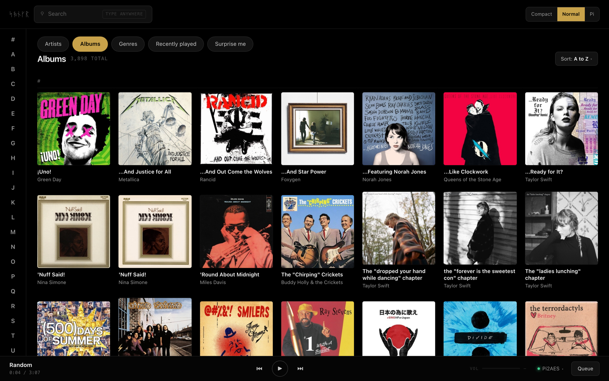
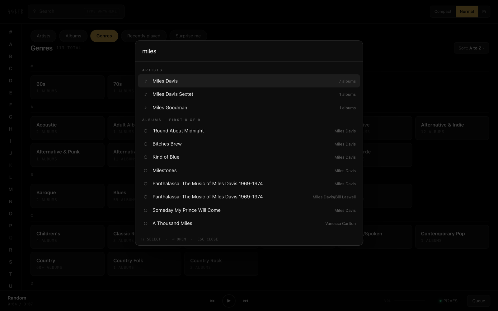

# Songr

Web-based controller for a local Roon Core, built with Node.js + SvelteKit.

Download the desktop app or headless server from
[GitHub Releases](https://github.com/roethlar/songr/releases/latest).
Desktop packages are available through Homebrew (`roethlar/tap/songr`),
Scoop (`roethlar` bucket, `songr`), AUR (`songr-bin`), and WinGet
(`roethlar.Songr`). The headless server is `songr-server` on npm;
Docker images are `ghcr.io/roethlar/songr:latest` and versioned `:vX.Y.Z` tags.

## Screenshots

| | |
|---|---|
|  |  |
|  | |

## What Works

- Browse and search library with alphabetic jump lists, quick-play, and artwork caching
- Search result drill-down uses an isolated Roon browse session and remaps fresh result keys after re-seeding
- Real-time zone and now-playing updates via Socket.IO (hydrated on page load)
- Transport controls: play/pause, previous/next, seek, volume
- Queue: per-zone subscription, track listing with artwork, play-from-here, shuffle/loop/auto-radio
- Global zone switching, persistent play bar with track/artist deep-links
- System media controls and hardware media keys via the Media Session API (see below)

## System media controls and media keys

The selected zone's now-playing state is published to the browser's Media
Session API: title, artist, album, artwork and position, with play, pause,
next, previous and seek handlers that send the same socket commands the
on-screen transport buttons send. In Chromium that feeds the OS media surface —
MPRIS on Linux, System Media Transport Controls on Windows, Now Playing on
macOS — so hardware media keys can drive Roon playback.

**Why the page plays a silent audio clip.** A controller plays no audio of its
own, and metadata alone does not get a page onto the OS media surface. The
Media Session spec is explicit that `playbackState` "MUST not affect media
session routing", and the routing itself is the user agent's choice: Chromium
selects the page holding audio focus, based on media elements that are
potentially playing and *not muted*. So while a track is loaded in the selected
zone, the page loops a generated clip of digital silence through one detached
`<audio>` element. It is left unmuted at full volume on purpose — muting it
would remove the player from the media session and defeat the point — and it
carries no signal, so there is nothing to hear. The clip is 20 seconds long
because Chromium treats very short media as a transient sound effect rather
than as media worth a session. Browsers may refuse to start it until the page
has seen a user gesture; it retries on the next click or keypress.

**What is and is not verified.** The repository's Playwright suite proves in
the pinned Chromium that the clip decodes and plays unmuted, that the metadata,
artwork and position payloads are accepted, and that every action handler
registers. Whether a given desktop actually routes its hardware media keys to
the browser is a property of the browser build and the desktop environment, and
no automated test can press a hardware key: MPRIS behaviour on Linux and the
macOS Now Playing panel have not been verified in this repository.

## Library

The Library combines switchable scopes (Artists / Albums / Genres /
Recently played / Favorites / Surprise me), a live Browse scope, instant
palette search, per-scope sorts, and density control. Artist, album, genre,
composer and track pages carry durable `/library/...` addresses that survive
a reload, a fresh tab, and Back/Forward.

Everything the Library shows comes from Roon's own public Browse API. Songr
reads nothing from the Core that Roon does not publish, and it holds no
library data of its own between runs.

## Upgrading

```bash
git pull && sudo ./scripts/install.sh --reinstall
```

That is the whole upgrade. The install rebuilds the backend and frontend,
preserves pairing/config/data, and restarts the service. Dependencies are
vendored in the repository, so a plain `npm ci` works everywhere — no git
sourcing, no flags.

## Queue API Limitation

Roon's public transport API (`node-roon-api-transport`) does not expose remove/reorder endpoints. All currently available queue controls are implemented.

## Tech Stack

- **Backend**: Node.js, TypeScript, Express, Socket.IO
- **Roon**: `node-roon-api`, `node-roon-api-transport`, `node-roon-api-browse`, `node-roon-api-image`
- **Frontend**: SvelteKit (static adapter — no SSR required)
- **Logging**: Pino

## Repository Layout

```
src/       Backend TypeScript source
ui/        SvelteKit frontend (built to ui/build/)
vendor/    Vendored Roon dependencies (node-roon-api*, pinned commits)
scripts/   Installer scripts (Linux, macOS, Windows)
deploy/    Systemd service template
config/    Roon pairing token (gitignored)
Dockerfile Multi-stage build: backend + frontend → single image/port
```

## Configuration

Copy `.env.example` to `.env` and adjust as needed.

| Variable | Description | Default |
|---|---|---|
| `HOST` | Bind address. `0.0.0.0` makes the UI reachable on the LAN; set `127.0.0.1` for localhost-only (recommended behind a reverse proxy) | `0.0.0.0` |
| `PORT` | HTTP port (serves API + UI) | `3333` |
| `LOG_LEVEL` | Pino log level. `trace` enables raw Roon payload dumps for debugging | `info` |
| `ROON_TOKEN_PATH` | Roon pairing-state file (paired_core_id + per-core tokens) | `./config/roon-token.json` |
| `IMAGE_CACHE_PATH` | Artwork disk cache | `./data/image-cache` |
| `CATALOG_PATH` | Where an earlier install's saved catalog store sits, so it can be removed at start; Songr keeps no library model on disk (the legacy `TIMELINE_CATALOG_PATH` key is still honored) | `./data/catalog` |
| `IMAGE_CACHE_MAX_BYTES` | Disk cache cap (bytes); LRU eviction when exceeded | `10737418240` (10 GB) |
| `RECENTLY_PLAYED_PATH` | JSON file for "Recently played on this controller" persistence | `./data/recently-played.json` |
| `RECENTLY_PLAYED_CAP` | Max entries kept in the rolling list (1-1000) | `50` |
| `FAVORITES_PATH` | JSON file for user-curated favorites (tracks/albums/artists) | `./data/favorites.json` |
| `CLIENT_ORIGIN` | Comma-separated Socket.IO CORS allowlist, or `*` for any | `*` |
| `TRUST_PROXY` | Set to `true` when fronted by a reverse proxy so rate limits identify the real client IP | unset |

### Security notes

- The default `HOST=0.0.0.0` exposes the controller on every interface. There is **no built-in authentication** — anyone reachable on the network can browse, search, and control playback. For a single-purpose home appliance on a trusted LAN this is intentional. For anything broader, bind to `127.0.0.1` and front with a reverse proxy that adds auth, or set `CLIENT_ORIGIN` to your specific frontend origin(s).
- HTTP responses include Helmet defaults (CSP, `X-Content-Type-Options`, etc.). The `/api/*` surface is rate-limited to 600 requests/minute per IP.
- The Roon pairing token is written with file mode `0o600` under a directory created with mode `0o700`.

## Install

Each installer builds from source, deploys to a system directory, and registers a service that starts on boot. Run from the repository root.

### Linux

```bash
sudo ./scripts/install.sh
```

Options: `--port PORT`, `--install-dir DIR` (default: `/opt/roon-controller`), `--user USER` (default: `roon`), `--reinstall`, `--no-start`

### macOS

```bash
sudo ./scripts/install-macos.sh
```

Options: `--port PORT`, `--install-dir DIR` (default: `/opt/roon-controller`), `--reinstall`, `--no-start`

Installs as a launchd daemon. Logs at `/Library/Logs/RoonController/`.

### Windows

Requires [NSSM](https://nssm.cc/) (`winget install nssm` or `choco install nssm`). Run in an elevated PowerShell:

```powershell
.\scripts\install-windows.ps1
```

Options: `-Port`, `-InstallDir` (default: `C:\Program Files\RoonController`), `-Reinstall`, `-NoStart`

### Docker

```bash
cp .env.example .env   # optional — only to override defaults
docker compose build
docker compose up -d
```

With the default paths, the `./config/` and `./data/` volumes persist the Roon
pairing token, artwork cache, Recently Played history, and
Favorites across container restarts. If you override any persistence path to a
location outside those directories, mount that location separately.

## Local Development

```bash
./scripts/run-local.sh        # installs deps and starts both servers
```

Or manually:

```bash
npm install && npm run dev                        # backend on :3333
cd ui && npm install && npm run dev -- --host     # frontend on :5173 (proxies /api → :3333)
```

## Validation

```bash
npm run build
npm test -- --runInBand
npm run lint
npm --prefix ui run check
npm --prefix ui test
npm --prefix ui run build
```

## Pairing

On first run: Roon → Settings → Extensions → enable **Songr (your machine's name)**
(installs paired before mid-2026 may still show the older name "Custom Roon
Controller").

Roon's pairing state — `paired_core_id` plus a per-core token map — is persisted to `ROON_TOKEN_PATH` (mode `0o600`, atomic write). Reconnect is automatic on subsequent starts.

Older builds accidentally let `node-roon-api` write `config.json` in the working directory. On first run, an existing `config.json` in the cwd is migrated to `ROON_TOKEN_PATH` and the cwd copy removed. No action required from you.

## Handoff

Read `AGENTS.md` (canonical guidance) and `.agents/state.md` (current state, active
work, next steps) before continuing work. Durable decisions live in
`.agents/decisions.md`. Update `.agents/state.md` at the end of a session.
